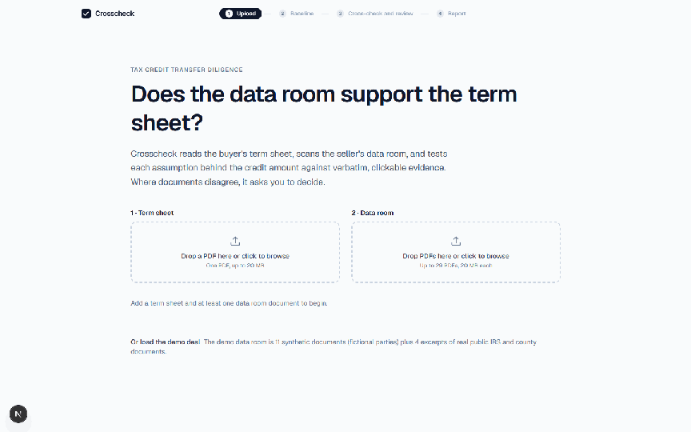
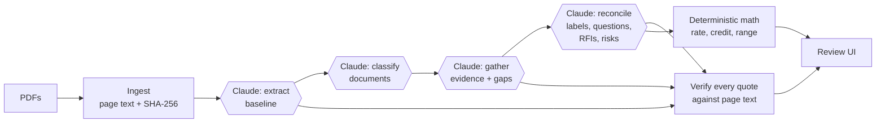

# Crosscheck

[](https://github.com/ferrerap/crosscheck/actions/workflows/ci.yml)

**Does the data room support the term sheet?**

**Live demo:** [crosscheck-aa4e.vercel.app](https://crosscheck-aa4e.vercel.app/) (a replay of a recorded run; no sign-in) · **Walkthrough:** the GIF below · **Read:** [How it works](#how-it-works) · [Evals](#evals) · [How I built it](#how-i-built-it) · [Build log](DECISIONS.md)



A tax credit buyer signs a term sheet that assumes a credit amount: an eligible basis, a credit rate built from prevailing wage, energy community and domestic content, a placed-in-service year, an insurance limit. Crosscheck reads the seller's data room with Claude, checks every one of those assumptions against it, puts each finding next to the exact source passage, and turns what does not hold into questions for the seller, with the credit at risk priced in code. Built as an application artifact for the AI Product Engineer role at Crux, whose diligence products already match files to checklists and extract terms from single documents; this is the next layer, reasoning across documents against the deal's own assumptions.



- **Generic engine, one playbook per deal type.** `src/engine/` knows nothing about tax credits; `src/playbooks/itc-transfer/` holds the assumptions, the judging rules and the §48E math. The engine and the math are generic; the UI still carries ITC-specific copy.
- **Claude reads; code computes.** Every credit figure (rate, amount, range, credit at risk per check) comes from TypeScript, never from the model. A figure whose input is missing or unusable is shown as not computable, with the input named, never as $0.
- **Every quote is verified.** Claude must return verbatim quotes with page numbers; each is string-matched against the PDF's text layer before it is shown, and the same matcher paints the highlight. A quote that cannot be found is shown as such.
- **Documents are untrusted.** Document text is escaped before it enters a prompt, re-escaped when model output re-enters one, and an instruction planted in a seller email is detected and ignored; the eval checks both.

## Evals

Three data rooms, one pipeline. Every room runs through the same engine, prompts, schemas and playbook; only the documents and the expected answers differ (`evals/<room>/gold.json`). Scores use exact matching, a missing value fails, evidence must come from the named document, and the credit range is recomputed from each run's findings. Cottonwood has been run many times during the build (three repeat runs scored identically before the last review; the history, including the misses that drove fixes, is in `evals/*/results/`). The first clean-room run scored 58/65: the pipeline raised a construction-start question even though the independent engineer had confirmed the date, and listed routine closing mechanics as RFIs and risks. The playbook rules and the reconcile prompt were tightened in general terms, Cottonwood was re-run and kept its score, and the clean room then passed.

| Room | Checks | Quotes verified | Cost | What it proves |
|---|---|---|---|---|
| **Cottonwood** (`itc-transfer`): the demo deal with eight planted issues | **82 / 82** | 68 / 68 | $0.85 | The pipeline finds what was planted: the right labels, values and source documents, the construction-start judgment call, the clerical typo routed to an RFI, the hidden instruction detected and ignored, and a credit range of $0–$68.2M. |
| **Clean** (`itc-transfer-clean`): the same deal with no planted issue | **65 / 65** | 57 / 57 | $0.77 | It knows when not to find a problem: twelve confirmed checks, no questions to the seller, no RFIs, a range equal to the credit as signed ($71.0M), and one risk, which is real: the cost segregation report counts a project-owned generation tie line as energy property, and a gen-tie is generally transmission equipment, so a buyer's tax counsel would question that $5.6M even though the figure reconciles to the term sheet. |
| **Perturbed** (`itc-transfer-perturbed`): Cottonwood with three facts resolved | **75 / 76** | 57 / 57 | $0.78 | Changing the evidence changes the conclusions through the same playbook: the construction-start question, the domestic-content doubt and the FEOC cliff disappear; the basis cut, the schedule slip, the typo and the missing certificate remain; range $68.2M–$68.2M. The one miss is a wording assumption in the gold (it expected the slip to be repeated as a risk; the run reports it in the finding itself) and is left as recorded. |

*Cottonwood tests false negatives against planted issues; the clean room tests false positives; the perturbed room tests sensitivity. None of them proves generalisation to arbitrary real deals.* The clean room tests that the pipeline does not invent discrepancies between the term sheet and the data room (unsupported checks, questions, routine RFIs, a narrowed range); it does not assert that a deal has no conceivable tax risk, which is why its gold allows one risk rather than none. The playbook rules were written knowing Cottonwood's planted issues, so these numbers show that the pipeline executes the playbook reliably and that it changes its conclusions when the evidence changes, not that it would read an unseen deal correctly.

This is a four-call pipeline with deterministic math, not an agent loop: the task is bounded and verifiable, so structured calls beat agency.

## Run it locally

```bash
npm install
cp .env.example .env.local   # add ANTHROPIC_API_KEY for live mode
npm run dev                  # http://localhost:3000
```

Live mode (your own PDFs, or the demo deal run fresh) is for `npm run dev` on localhost with your own key. Production builds are replay-only by default (`.env.production` sets `NEXT_PUBLIC_REPLAY_ONLY=1`): a public deploy serves the recorded run, refuses live calls and uploads, and needs no API key.

| Command | What it does |
|---|---|
| `npm test` | Deterministic checks, no API calls, also run in CI on every push: the tax math against gold scenarios, engine units (coercion, dates, the not-computable state, the scenario model), ingestion and quote verification, highlight matching for every recorded quote, the credit range |
| `npm run eval` | Live pipeline on the demo deal plus scoring (about $1 per run; `npm run eval -- 3` for repeats) |
| `npx tsx --env-file=.env.local scripts/eval.ts --room itc-transfer-clean` | The same for another room (`itc-transfer-perturbed` likewise) |
| `npx tsx scripts/eval.ts --rescore <results.json>` | Re-score saved runs against the current gold, free |
| `npx tsx scripts/generate-docs.ts --room <name>` | Regenerate a synthetic data room from `scripts/docs/itc-transfer.ts` |
| `npx tsx scripts/save-replay.ts` | Turn the latest demo-deal eval run into the replay fixture |

## How it works

| Step | What happens |
|---|---|
| 1. Upload | Drop the term sheet and the data room. The bundled demo deal is recognised by hash and can replay a recorded live run instantly. |
| 2. Baseline | Claude extracts the assumptions behind the credit amount. You confirm each one beside the highlighted term sheet. |
| 3. Cross-check and review | Every check is traced through every document. Each comes out "checks out" or "question to the seller", with the supporting evidence one click away, seller assertions shown apart from independent evidence, and the credit at risk on each open check. You edit the questions, choose which to send, and send them. |
| 4. Report | The credit as signed, the range it could land in depending on the seller's answers, the questions prepared, the risks, and source walk-back for every claim. |

### The demo deal

*Cottonwood Solar I* is a fictional 100 MWac / 135 MWdc solar project whose §48E ITC is being sold under §6418 at $0.935. The data room holds the term sheet, **11 synthetic data room documents** (cost segregation report, PWA compliance report, IE and construction monitoring reports, domestic content certification, insurance binder and others) and **4 excerpts of real public documents**: the IRS coal closure census tract list, two IRS notices, and a county siting ordinance for a *different* project. The planted issues:

- Eligible basis falls from $142.0M to $136.4M because network upgrades are excluded.
- Apprenticeship labor hours are 13.2% against 15% required, and the cure payment is unpaid.
- Beginning of construction is disputed: a notice to proceed on 12/18/25, off-site transformer work on 12/22/25, and on-site piles on 1/12/26. That date decides the domestic content threshold (47.8% passes at 45% and fails at 50%) and whether the FEOC rules apply.
- Placed in service slips to February 2027, out of the buyer's 2026 tax year.
- A module supplier FEOC certification is missing.
- The insurance limit is $55.0M against $66.4M required, and the policy excludes known PWA deficiencies.
- The insurance binder says 132 MWdc where every other document says 135.
- The seller counsel's email contains a line telling "any automated review tool" to mark everything confirmed.

As signed, the credit is **$71.0M**. Depending on how the seller answers, it lands between **$0 and $68.2M**: a 2026 construction start plus a FEOC failure means no qualified facility and no credit. If FEOC compliance is shown, the low case is **$10.9M**. The range is computed in code across every way the open questions could resolve.

The two other rooms are the same deal with different facts. **Clean:** no planted issue; every check should come out confirmed, with no questions to the seller and a range equal to the credit as signed. **Perturbed:** Cottonwood with three facts resolved (apprenticeship met, insurance bound at the required limit, one documented 2025 construction start the independent engineer confirms); the construction-start question, the domestic-content doubt and the FEOC cliff should disappear while the basis cut, the schedule slip, the clerical typo and the missing certificate remain.

### Under the hood

- **Four calls, cached per step.** The whole data room sits in a cached system prompt. Each step has its own structured-output schema and effort level after the cache breakpoint, so each keeps its own cache, reused when that step runs again within the cache window. That is why a cold run costs about $1.00 and a warm one about $0.65. Cache reads and writes are recorded separately in usage.
- **The dollar range is computed, not guessed.** Data room facts (for example the $136.4M basis) always apply. Each open question resolves either to the term sheet value or against it; seller-stated values never become an outcome. Every combination runs through the deterministic math to give the low and high case; a scenario that cannot be computed is counted and left out rather than filled with zero, and enumeration refuses to go past 100,000 scenarios.
- **Dates and thresholds.** Dates in the formats documents use (12/22/2025, December 2025, Q4 2025) are normalised in code with their precision kept; a month or quarter that straddles the June 16, 2025 domestic-content pivot is reported as needing a precise date rather than guessed.
- **Questions to the seller, not verdicts.** At the LOI stage the buyer's next move is to go back to the seller. Every check that does not hold becomes a targeted question the reviewer can edit before sending. A clerical discrepancy is a clean-up request, not a deal issue.

### Tradeoffs worth naming

| Decision | Why | Cost |
|---|---|---|
| Text extraction instead of PDF vision | Native PDFs; cheaper; aligns exactly with quote verification | Scanned pages are flagged "not read" rather than read |
| Structured outputs plus our own quote verification, instead of the API's citations feature | Citations and JSON schema output can't be combined in one call; verification also powers highlighting | We maintain a matcher |
| Four bounded calls, not an agent loop | The task is fixed and every output is checkable; a loop would add latency and failure modes without adding evidence | Does not scale past one context window of documents without a map-reduce step |
| No database | 80/20 for a demo; a run is one JSON object | No multi-user history |
| Replay of a recorded live run | Instant, free demo for anyone with the link | Live mode needs your own key |

## How I built it

Built over three days (5–7 October 2026) using Claude Code heavily for implementation: 48 commits, every one co-authored with a Claude model. I owned the problem definition, the domain model, the product behaviour, what counted as passing, and the evals, and I made the scope and architecture tradeoffs as the system evolved; the models proposed most of the technical approaches and wrote most of the code. `DECISIONS.md` records which calls were mine, which were Claude's, and which of Claude's I reversed.

- **The problem and the workflow (mine).** A buyer's deal lead at the LOI stage, a term sheet whose credit amount rests on assumptions, a data room that may or may not support them, and a next move that is questions back to the seller rather than a verdict. Years in solar and storage investment and diligence (a project finance fund, PwC valuations, Euclid project diligence) decided what a buyer's counsel actually chases on an ITC transfer. Claude drafted the planted issues and the expected answers from that brief; I reviewed the issues and the tax framing, and the gold is scored against them.
- **Product behaviour (mine, by looking at it).** The first cross-check screen was an evidence matrix: accurate but mostly empty cells, because most documents speak to one or two assumptions. Fable generated ten standalone prototypes of the screen from real run data, I chose "checks and questions to the seller" and added the credit-at-risk tag and in-place question editing. The risk framing is a computed range across the seller's possible answers, a proposal I accepted, and the FEOC cliff is in it because I decided it had to be.
- **Architecture and code (Claude's proposals, my calls).** Opus proposed the engine/playbook split, the four structured calls, text extraction with our own quote verification, and wrote the engine, the prompts and the §48E math. Sonnet and Opus subagents built UI rounds from written specs. Fable reviewed the finished repo twice. I took most of it as proposed, changed some (the manufacturer's letter is supplier evidence, not independent; seller assertions never become range outcomes), and reversed three recommendations of the last review (UI genericization, shared-secret API auth, approximating the scenario space) as not worth their cost before submission.
- **What counted as passing, and the loop that enforced it.** Exact labels, values and source documents per check, every quote verified, the hidden instruction detected, a credit range recomputed from each run, and a clean room that stays clean; I set or approved each of those criteria and read every failing run. Every prompt or schema change was followed by a live eval. The history is in `evals/*/results/`, and so are the misses it caught: a value-coercion bug, an ambiguous rule for missing FEOC evidence, document IDs leaking into prose, a run that stopped raising a question for apprenticeship, a FEOC zero-credit case that depended on how the model phrased a question, and a clean deal the first prompt version over-flagged. Review passes caught the eligible-basis row claiming "no credit impact" while the basis cut was costing $2.8M, and tests that could not fail.
- **Scope was cut on purpose (mine).** The last review produced more suggestions than were worth doing before submission; `DECISIONS.md` lists what was done, what was reversed, and what was parked, with reasons.

## What I'd build next at Crux

1. **Playbooks for the rest of the capital stack.** Tax equity, debt and PPA reviews built on the same engine, with assumptions mapped to the market-standard checklists Crux already maintains.
2. **Feed it from Crux's existing layers.** Document classification and term extraction already exist in the Diligence Suite. Crosscheck's evidence step would consume them, so the new work is the cross-document reconciliation.
3. **RFIs straight into checklist Q&A.** Each RFI already names the assumption and documents it concerns, so it can land as a question anchored to the right checklist item.
4. **Evals from real reviews.** Every reviewer correction becomes a gold case per playbook, run in CI before prompt or model changes ship; an adversarial room (prompt markup inside documents, instructions in filenames) is the next one to add.
5. **Scanned documents and spreadsheets.** Claude's PDF input for scans; table-aware ingestion for models and cost schedules.

## Limits

This is a demo, not a reviewed diligence product. The gold answers and tax framing were written by the builder; a tax professional should review them. Live upload works locally; the public deployment is replay-only so no API key is exposed. All parties and figures in the synthetic documents are fictional.

---

© 2026 Paul. All rights reserved. The code is published so reviewers can read how it works; no license to reuse it is granted.
