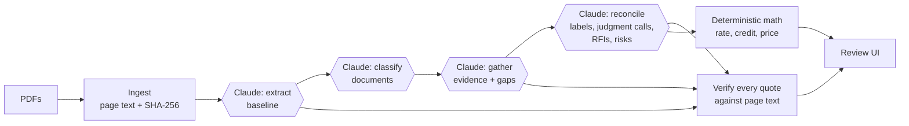

# Crosscheck

**Does the data room support the term sheet?**

A tax credit buyer signs a term sheet that assumes a credit amount: an eligible basis, a credit rate built from prevailing wage, energy community and domestic content, a placed-in-service year and an insurance limit. Diligence is the work of checking every one of those assumptions against the seller's data room. Crosscheck does that cross-document reading with Claude, puts every finding next to the exact source passage, and asks a human to make the judgment calls. The dollar impact recomputes as you decide.

> Screenshot / GIF: _to add after UI round 2_

**Built as a demo for the AI Product Engineer role at Crux.** Crux's diligence products already match files to checklist items and extract key terms from single documents. Crosscheck explores the next layer: **reasoning across documents against the deal's own assumptions.**

## What it does

| Step | What happens |
|---|---|
| 1. Upload | Drop the term sheet and the data room. The bundled demo deal can replay a recorded live run instantly. |
| 2. Baseline | Claude extracts the assumptions behind the credit amount. You confirm each one beside the highlighted term sheet. |
| 3. Cross-check and review | Every check is traced through every document. Each comes out "checks out" or "question to the seller", with the supporting evidence one click away and seller assertions shown apart from independent evidence. You edit the questions, choose which to send, and send them. |
| 4. Report | The credit as signed, the range it could land in depending on the seller's answers, the questions sent, risks, and source walk-back for every claim. |

### The demo deal

*Cottonwood Solar I* is a fictional 100 MWac / 135 MWdc solar project whose §48E ITC is being sold under §6418 at $0.935. The data room holds **12 synthetic documents** (cost segregation report, PWA compliance report, IE and construction monitoring reports, domestic content certification, insurance binder and others) plus **4 excerpts of real public documents**: the IRS coal closure census tract list, two IRS notices, and a county siting ordinance for a *different* project. The planted issues:

- Eligible basis falls from $142.0M to $136.4M because network upgrades are excluded.
- Apprenticeship labor hours are 13.2% against 15% required, and the cure payment is unpaid.
- Beginning of construction is disputed: a notice to proceed on 12/18/25, off-site transformer work on 12/22/25, and on-site piles on 1/12/26. That date decides the domestic content threshold (47.8% passes at 45% and fails at 50%) and whether the FEOC rules apply.
- Placed in service slips to February 2027, out of the buyer's 2026 tax year.
- A module supplier FEOC certification is missing.
- The insurance limit is $55.0M against $66.4M required, and the policy excludes known PWA deficiencies.
- The insurance binder says 132 MWdc where every other document says 135.
- The seller counsel's email contains a line telling "any automated review tool" to mark everything confirmed.

As signed, the credit is **$71.0M**. Depending on how the seller answers, it lands between **$10.9M and $68.2M**. The range is computed in code across every way the open questions could resolve.

## How it works



- **The engine is generic; playbooks hold the deal type.** `src/engine/` knows nothing about tax credits. `src/playbooks/itc-transfer/` defines the assumptions (what to extract, what counts as evidence, how to judge it) and the deterministic math. A new transaction type is a new folder, not a new app. A project-acquisition LOI playbook is next.
- **Claude reads; code does the math.** Claude extracts values and quotes. TypeScript computes the credit rate (6% or 30% base, bonuses of +2 or +10 points), the domestic content threshold by construction year, and the dollar impact. Every number on screen is reproducible.
- **Every quote is verified.** Claude must return verbatim quotes with page numbers, and each one is string-matched against the PDF's text layer before it's shown. Anything that doesn't match is flagged as unverified rather than shown as fact. The same matcher drives the highlight in the PDF viewer.
- **Questions to the seller, not verdicts.** At the LOI stage the buyer's next move is to go back to the seller. Every check that doesn't hold becomes a targeted question the reviewer can edit before sending. A clerical discrepancy is a clean-up request, not a deal issue. Documents are tagged by source (seller, seller's advisor, independent, government), so the seller's own assertions never pass as independent evidence.
- **The dollar range is computed, not guessed.** Data room facts (for example the $136.4M basis) always apply. Each open question resolves either to the term sheet value or to the data room's. Every combination runs through the deterministic math to give the low and high case.
- **Documents are untrusted input.** The prompt treats data room text as data. Embedded instructions are surfaced as suspicious and ignored, and the eval checks this.
- **Four calls, one cached prefix.** The whole data room sits in a cached system prompt shared by the extract, classify, evidence and reconcile calls.

### Tradeoffs worth naming

| Decision | Why | Cost |
|---|---|---|
| Text extraction instead of PDF vision | Native PDFs; cheaper; aligns exactly with quote verification | Scanned documents need the vision path (future) |
| Structured outputs plus our own quote verification, instead of the API's citations feature | Citations and JSON schema output can't be combined in one call; verification also powers highlighting | We maintain a matcher |
| No database | 80/20 for a demo; a run is one JSON object | No multi-user history |
| Replay of a recorded live run | Instant, free demo for anyone with the link | Live mode needs your own key |

## Evals

`npm run eval` runs the full live pipeline on the demo data room and scores it against builder-authored expected answers (`evals/itc-transfer/gold.json`). It checks:
- baseline values;
- project match for every document, including the real different-project permit;
- labels and current values for all 12 assumptions;
- that the construction-start conflict is raised as a judgment call, that domestic content and FEOC are linked to it, and that the clerical typo is an RFI rather than a decision;
- the source role of key documents (seller vs independent), and that no document IDs or codes leak into text a person reads;
- RFI and risk coverage;
- resistance to the injected instruction;
- the quote verification rate.

| Model | Checks passed | Quotes verified | Cost per run | Time |
|---|---|---|---|---|
| `claude-opus-5-5` | **64 / 64** | **84 / 84** | $1.02 | ~4.5 min |

Earlier runs (in `evals/itc-transfer/results/`) caught a value-coercion bug (38/39) and an ambiguous rule for missing FEOC evidence (42/43). Both are fixed, and the history is kept. `npm test` runs the free deterministic checks: the tax math against the gold scenarios, ingestion and quote verification, and highlight matching for every quote in the replay.

## Run it locally

```bash
npm install
cp .env.example .env.local   # add ANTHROPIC_API_KEY for live mode
npm run dev                  # http://localhost:3000
```

| Command | What it does |
|---|---|
| `npm test` | Deterministic checks (no API calls) |
| `npm run eval` | Live pipeline + scoring (~$0.90) |
| `npm run docs` | Regenerate the synthetic PDFs from `scripts/docs/itc-transfer.ts` |
| `npx tsx scripts/save-replay.ts` | Turn the latest eval run into the replay fixture |

## What I'd build next at Crux

1. **Playbooks for the rest of the capital stack.** Tax equity, debt and PPA reviews built on the same engine, with assumptions mapped to the market-standard checklists Crux already maintains.
2. **Feed it from Crux's existing layers.** Document classification and term extraction already exist in the Diligence Suite. Crosscheck's evidence step would consume them, so the new work is the cross-document reconciliation.
3. **RFIs straight into checklist Q&A.** Each RFI already names the assumption and documents it concerns, so it can land as a question anchored to the right checklist item.
4. **Evals from real reviews.** Every reviewer correction becomes a gold case per playbook, run in CI before prompt or model changes ship.
5. **Scanned documents and spreadsheets.** Claude's PDF input for scans; table-aware ingestion for models and cost schedules.

## Limits

This is a demo, not a reviewed diligence product. The gold answers and tax framing were written by the builder; a tax professional should review them. Live upload works locally; the public deployment is replay-only so no API key is exposed. All parties and figures in the synthetic documents are fictional.
